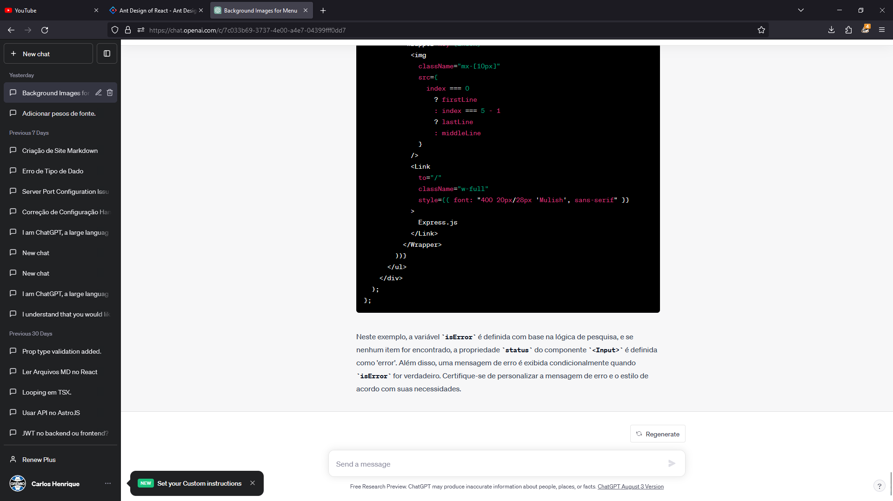

# this is h1 text

## this is h2 text

### this is h3 text

this is a paragraph and this is a [link](https://www.google.com) in the paragraph

this is a paragraph with `inline code`

this is a paragraph with **bold text**

this is a paragraph with _italic text_

this is a paragraph with ~~strikethrough text~~

this is a paragraph with **_bold and italic text_**

> this is a quote
>
> > this is a quote inside a quote

---

```js
console.log('This is a block of code');
```


